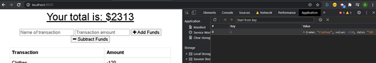

  # Welcome to budget-tracker (1.0.0)
  <a href="#">
    
  </a>


  ## Description 

  > This application allows users to track their withdrawals and deposits with out without a data/internet connection so that the user's account balance is accurate when they are travelling. This application is created with Express, Mongoose. It can perform the following functions :
  

  *  Enter deposits offline.

  * Enter expenses offline.

  * When brought back online, offline entries should be added to tracker

## Screen shots
* Initial Budget DB


### Manifest
* Manifest


### Index Database
* IndexDb offline mode


* IndexDb offline mode. Failed Transaction


* IndexDb offline mode. Database not updated


* IndexDb online mode


* IndexDb online mode. Database updated


### Service Worker
* Service Worker


### Cache Storage
* Cache Storage 1


* Cache Storage 2


### Live application

[Click here!!!](https://shielded-springs-69412.herokuapp.com/)


  ## Table of Contents

  * [Homepage](#homepage)
  * [Installation](#installation)
  * [Usage](#usage)
  * [Tests](#tests)
  * [Author](#author)
  * [Contributing](#contributing)
  * [License](#license)
  * [Questions](#questions)
  
  
  ## Homepage

  🏠 [Homepage](https://github.com/arpita-sahakar/budget-tracker#readme)
  

  ## Installation
  Run the following command to install all the required libraries
  ```bash
  npm install
  ```

 
  ## Usage 
   Run the following command to start the server
  ```bash
  node server.js
  ```


  ## Tests
  ```bash
  npm run test
  ```


  ## Author

  👤 **Arpita Kar**
  * GitHub: [@arpita-sahakar](https://github.com/arpita-sahakar)


  ## Contributing

  Contributions, issues and feature requests are welcome!

  Feel free to check [issues page](https://github.com/arpita-sahakar/budget-tracker/issues). You can also take a look at the [contributing guide](https://github.com/arpita-sahakar/budget-tracker).


  ## Questions

  Please send your questions and suggestions to [my email](arpita.sahaa@gmail.com)
  * GitHub: [@arpita-sahakar](https://github.com/arpita-sahakar)


  ## License

  Copyright © 2020 [Arpita Kar](https://github.com/arpita-sahakar).

  This project is [NPM](https://github.com/arpita-sahakar/budget-trackerr/blob/main/license) licensed.

  
 
